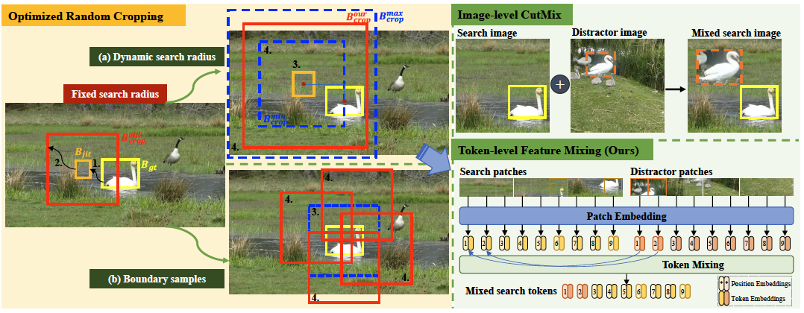

# DATr
PyTorch implementation of "Leveraging the Power of Data Augmentation for Transformer-based Tracking" (WACV2024)

## Introduction

## Installation
The environment installation and training configurations (like project path, pretrained models) are similar to the baseline tracker, e.g., OSTrack, please refer to [OSTrack](https://github.com/botaoye/OSTrack). 

## Training and Testing
Examples of the training and test commands are listed in the script: eval.sh
