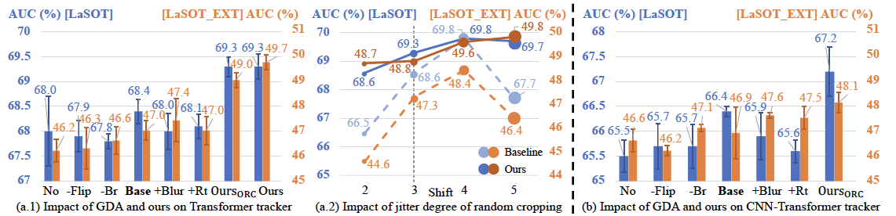

# DATr 
PyTorch implementation of "Leveraging the Power of Data Augmentation for Transformer-based Tracking" (WACV2024).

Please find the paper [here](https://arxiv.org/pdf/2309.08264.pdf)

## Introduction
In this paper, we perform systematic experiments to explore the impact of General Data Augmentations (GDA) on transformer trackers, including the pure transformer tracker and the hybrid CNN-Transformer tracker. Results below show GDAs have limited effects on SOTA trackers.

Then, We propose two Data Augmentation methods based on challenges faced by Transformer-based trackers, DATr for short. They improve trackers from perspectives of adaptability to different scales, flexibility to boundary targets, and robustness to interference, respectively.

Extensive experiments on different baseline trackers and benchmarks demonstrate the effectiveness and generalization of our DATr, especially for sequences with challenges and unseen classes.

## Installation
The environment installation and training configurations (like project path, pretrained models) are similar to the baseline trackers, e.g., OSTrack, please refer to [OSTrack](https://github.com/botaoye/OSTrack). 

## Training and Testing
Please see eval.sh to find the commands for training and testing.

## Models and Results
Models and results can be found [here](https://drive.google.com/drive/folders/19-jBvfFVZxPcvZmy6ZXwtyW6NCnQ6bjY?usp=share_link).

## Acknowledgments
Our work is mainly implemented on three different Transformer trackers, i.e., [OSTrack](https://github.com/botaoye/OSTrack), [MixFormer](https://github.com/MCG-NJU/MixFormer), and [STARK](https://github.com/MasterBin-IIAU/Stark-1). Thanks for these concise and effective SOT frameworks.
